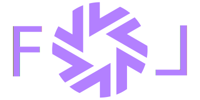

<p align="center">
    
</p>


<a href="https://follang.github.io/" style="color: rgb(179, 128, 255)"></a><h2><p align="center" style="color: rgb(179, 128, 255)">https://follang.github.io/</p></h2></a>

<p align="center">
  <a href="https://github.com/follang/fol/blob/develop/LICENSE.md"></a>
  <a href="https://travis-ci.org/follang/fol"></a>
  <a href="https://codecov.io/github/follang/fol"></a>
  <a href="https://gitter.im/follang/community"></a>
  <a href="https://github.com/follang/fol/blob/develop/.all-contributorsrc"></a>
</p>

<p align="center">general-purpose and systems programming language</p>
<hr>


FOL is a general-purpose, systems programming language designed for robustness, efficiency, portability, expressiveness and most importantly elegance. Heavily inspired (and shamelessly copying) from languages: zig, nim, c++, go, rust, julia (in this order), hence the name - FOL (Frankenstein's Objective Language). In Albanian language "fol" means "speak".

<p align="center">  ** FOL IS STILL JUST AN IDEA **  </p>

<hr>

## BUILDING BLOCKS


__*Everything*__ in **FOL** is declared like below:

```
	declaration<options> name: returntype = { body; };
	declaration<options> name: returntype = { body; } | { checker } | { alternative; };
```


#### four top-most declarations are:
```
	use    // imports, includes ...
	def    // macros, bocks, definitions ...

	var    // all variables: ordinal, container, complex, special

	pro    // subporgrams with side effects - procedures
	fun    // subporgrams with no side effects - functions
	log    // subporgrams with logic only - logicals

	typ    // new types: records, entries, blueprints ...
	ali    // aiased types and extensions
```
#### a control flow and keywords:
```
	when(condition){ case (){}; case (){}; * {}; };
	loop(condition){  };

```

#### example:

```
use log: mod[std] = {fmt::log};


def argo: mod[init] = {
    -var const: str = "something here"

    +pro main: int = {
        log.warn("Last warning!...");
        .echo(add(3, 5));
    }

    fun add(a, b: int): int = { a + b }
}
```
